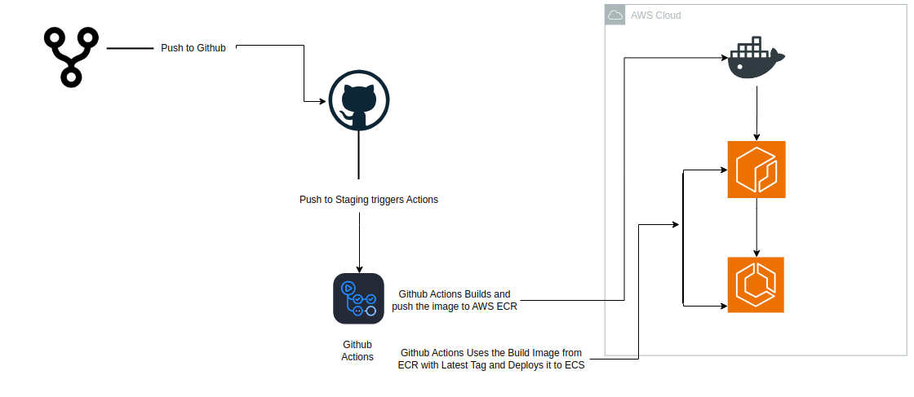

CI/CD Pipeline for Building and Deploying Docker Image to ECS
=============================================================

This GitHub Actions pipeline automates the process of building a Docker image from the repository, pushing it to Amazon Elastic Container Registry (ECR), and deploying the new image to an Amazon Elastic Container Service (ECS) cluster.

 
Overview
--------

The pipeline is triggered whenever there is a push event to the stagging branch. Once triggered, the following steps are executed:

1.  **Checkout the repository**: The pipeline checks out the latest code from the repository.
    
2.  **Configure AWS credentials**: AWS credentials are configured to enable access to AWS services.
    
3.  **Login to Amazon ECR**: The pipeline logs in to Amazon ECR to enable pushing the Docker image.
    
4.  **Build and push Docker image**: A Docker image is built from the source code and then tagged and pushed to Amazon ECR.
    
5.  **Deploy to ECS**: Finally, the image is deployed to an ECS service by forcing a new deployment, updating the ECS service with the latest Docker image.
    

### CI/CD Pipeline Diagram

_Here you can include an architecture or workflow diagram that shows the steps in this CI/CD pipeline._

Prerequisites
-------------

*   AWS account with permissions to use ECR, ECS, and IAM.
    
*   Docker installed locally (for testing locally).
    
*   GitHub repository with appropriate secrets set up for AWS access.
    

Environment Variables and Secrets
---------------------------------

*   **Environment Variables**: The pipeline uses predefined environment variables such as AWS\_DEFAULT\_REGION, ECR\_IMAGE\_REPO, ECS\_CLUSTER, and ECS\_RESOURCES\_SERVICE. These can be configured within GitHub repository settings.
    
*   **Secrets**: AWS credentials are securely stored in GitHub Secrets as AWS\_ACCESS\_KEY\_ID, AWS\_SECRET\_ACCESS\_KEY, and AWS\_ACCOUNT\_ID.
    

Steps in the Pipeline
---------------------

1.  **Checkout Repository**:The pipeline uses the actions/checkout GitHub action to retrieve the latest source code from the repository.
    
2.  **Configure AWS Credentials**:The aws-actions/configure-aws-credentials action is used to configure AWS credentials, allowing the pipeline to interact with AWS services.
    
3.  **Login to Amazon ECR**:The pipeline logs in to ECR by retrieving a login token using the AWS CLI and then authenticates Docker using that token.
    
4.  **Build and Push Docker Image**:The Docker image is built from the current repository and tagged using the repository name and latest tag. The image is then pushed to ECR.
    
5.  **Deploy to ECS**:After the image is pushed, the ECS service is updated by forcing a new deployment using the AWS CLI. This deploys the new image to the ECS cluster.
    

Conclusion
----------

This GitHub Actions pipeline automates the entire process of building, pushing, and deploying Docker images to AWS, ensuring your application is always up to date with the latest code changes. It makes use of several AWS services, including ECR and ECS, providing a scalable and highly available architecture for your application.