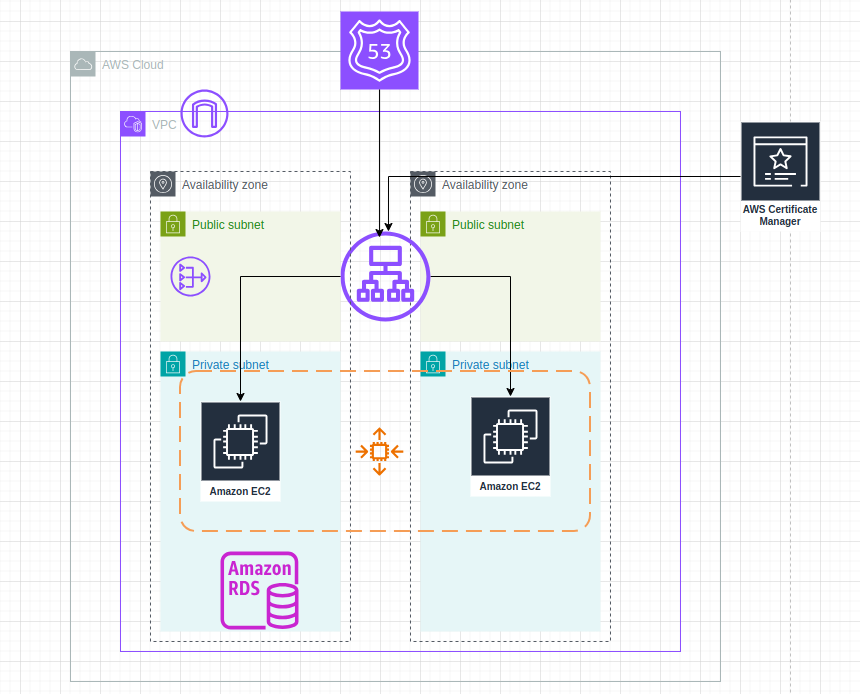

# Deploying a Highly Available & Scalable WordPress Server on AWS

## Overview

This project focuses on setting up a highly available and scalable WordPress website on Amazon Web Services (AWS). WordPress is one of the most popular content management systems used for building websites, and with this infrastructure, your website will be robust, efficient, and capable of handling many visitors at once.

By utilizing various AWS services, this project ensures that your WordPress site remains online, even if there are unexpected issues. It employs a combination of services such as virtual networks, security measures, and automated resources to create a seamless experience for your users.


 

## Key Benefits

1. **High Availability**: Your website will be accessible even during peak times or when certain components face issues. This is achieved through multiple servers that can handle user requests seamlessly.

2. **Scalability**: As your website grows and attracts more visitors, the infrastructure can automatically adjust to meet the demand, ensuring smooth performance without any downtime.

3. **Security**: By implementing security groups and best practices, your website will be protected against unauthorized access and other security threats.

4. **Ease of Management**: This setup allows for easy updates and management, making it straightforward to maintain your WordPress website.


## Prerequisites

Before you begin, ensure that you have the following prerequisites installed:

- [Terraform](https://www.terraform.io/downloads)
- [AWS CLI](https://docs.aws.amazon.com/cli/latest/userguide/getting-started-install.html)
- [AWS IAM User Account](https://aws.amazon.com/console/)
- [WordPress](https://wordpress.org/download/)

## Getting Started

1. **Initialize the Terraform workspace**
   
   ```bash
   terraform init
2. **Review the Terraform plan:**
   
   ```bash
   terraform plan
3. **Deploy the infrastructure:**
   
   ```bash
   terraform apply
4. **Destroy the infrastructure (when done):**
   ```bash
   terraform apply
   

## File Details

This Terraform project is structured into several modules, each responsible for managing a specific aspect of the infrastructure:

- `alb.tf`: Defines the Application Load Balancer (ALB) and related resources.
- `asg.tf`: Configures the Auto Scaling Group (ASG) and associated policies.
- `launch-template.tf`: Creates the Launch Template for EC2 instances.
- `output.tf`: Defines output variables to display after provisioning.
- `route53.tf`: Manages Route 53 DNS records.
- `security-group.tf`: Sets up security groups for different components.
- `variables.tf`: Contains input variables used across the project.
- `vpc.tf`: Handles the creation of the Virtual Private Cloud (VPC) and subnets.
- `terraform.tfvars`: Contains the values for input variables used in the project.
- `amazon.sh`: Shell script used in user data for EC2 instances.


## Providers

| Name | Version |
|------|---------|
| <a name="provider_aws"></a> [aws](#provider\_aws) | 5.40.0 |
| <a name="provider_local"></a> [local](#provider\_local) | 2.4.1 |
| <a name="provider_tls"></a> [tls](#provider\_tls) | 4.0.5 |

## conclution
This project not only demonstrates a solid approach to setting up a highly available and scalable WordPress server but also showcases the power of using AWS to meet modern web needs. Whether you’re launching a new website or looking to enhance an existing one, this setup will provide a strong foundation to ensure your site performs well and remains secure.

If you have any questions or need further details, please don’t hesitate to reach out!